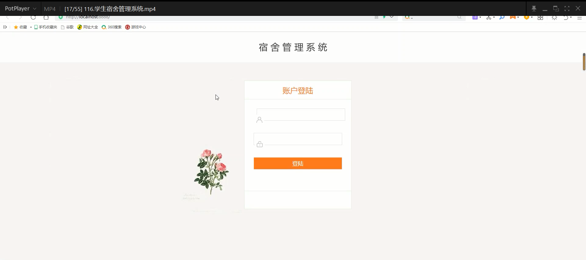
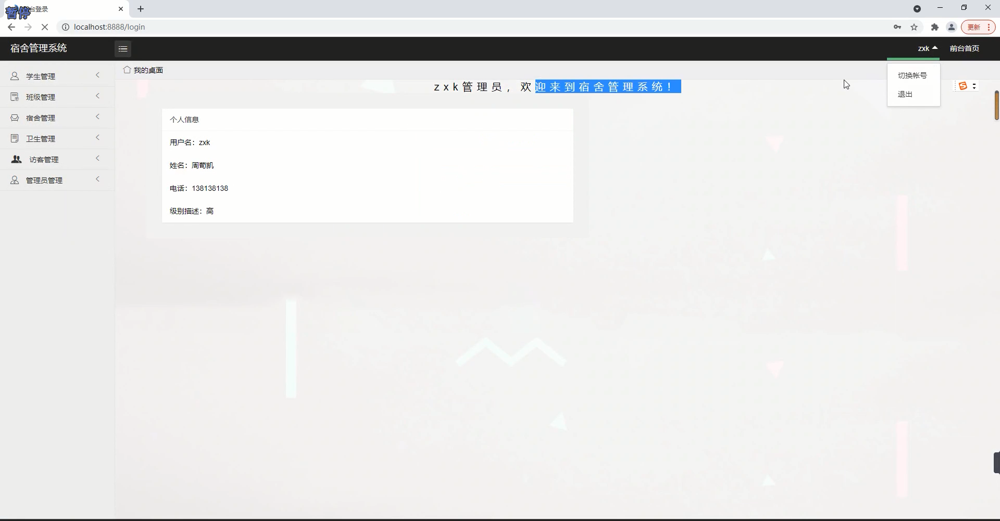
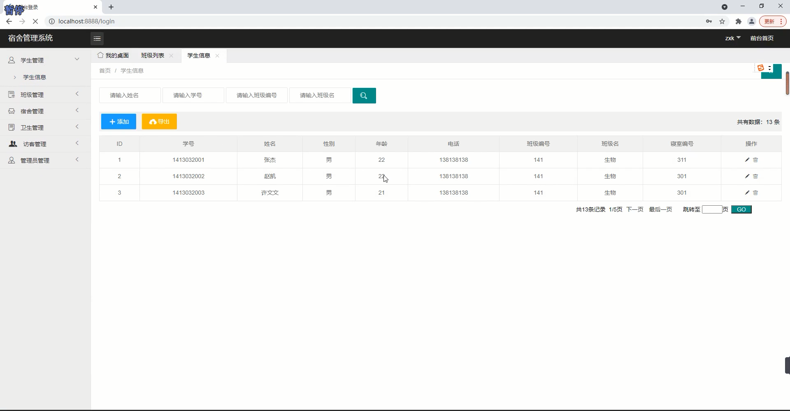
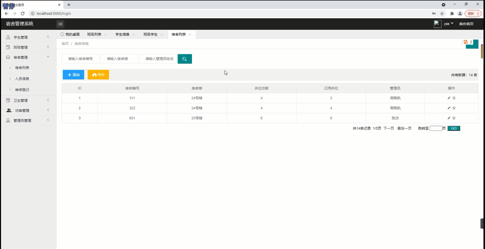
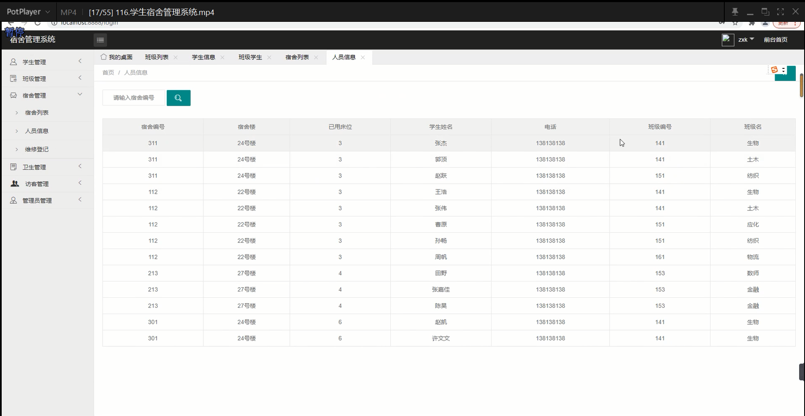
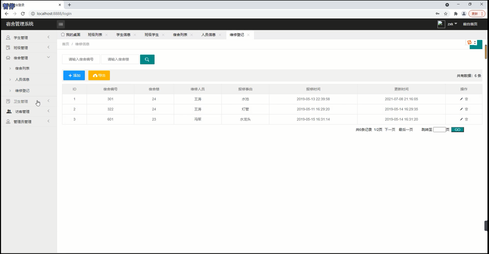
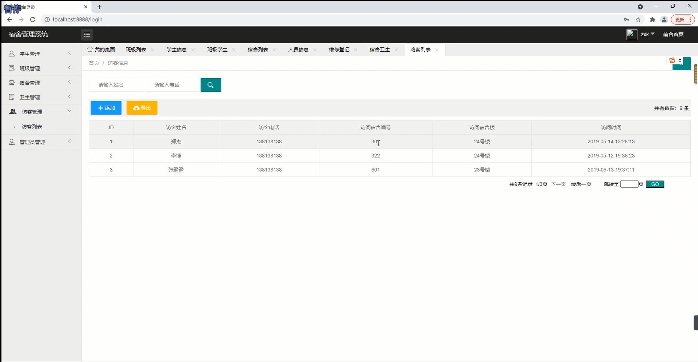
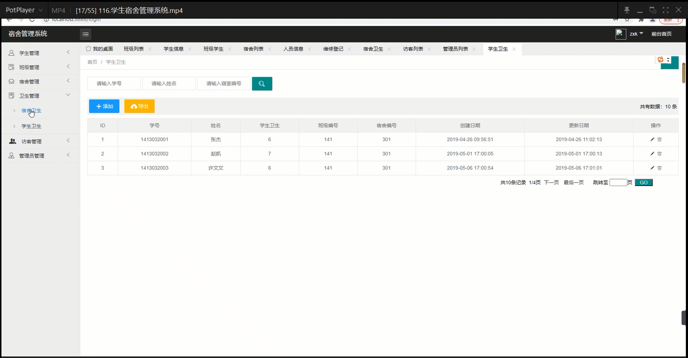

## 基于SSM框架的宿舍管理系统

###  获取sql数据库文件: 从戎源码网 (https://armycodes.com/) QQ: 386869957 QQ群: 377586148
###  所有系统地址: (https://github.com/YuLin-Coder/AllProjectCatalog) 
###  所有项目以及源代码本人均调试运行无问题 可支持远程安装部署调试、定制修改、代码讲解

## 项目介绍
基于SSM框架的宿舍管理系统，主要功能如下

1. 学生管理：
- 学生信息维护：管理员可以添加、编辑和删除学生的基本信息，包括姓名、性别、班级和联系方式等。
- 学生入住管理：管理员可以记录学生的宿舍楼号、楼层和房间号等信息。
- 学生退宿管理：管理员可以处理学生退宿申请，并更新宿舍信息。

2. 班级管理：
- 班级信息维护：管理员可以添加、编辑和删除班级的基本信息，包括班级名称、年级、专业等。
- 班级成员管理：管理员可以将学生分配到对应的班级，并查看班级成员列表。

3. 宿舍管理：
- 宿舍楼管理：管理员可以添加、编辑和删除宿舍楼的基本信息
- 宿舍信息维护：管理员可以记录每个宿舍房间的基本信息，等
- 宿舍卫生管理：管理员可以记录宿舍的卫生情况，包括卫生评分、卫生检查记录等。
- 宿舍维修登记：管理员可以记录宿舍的维修需求

4. 人员信息维护：
- 人员基本信息维护：管理员可以添加、编辑和删除校外人员的基本信息
- 访客管理：管理员可以记录校外人员的访问信息，

5. 数据导出：
- Excel导出：管理员可以将学生、班级、宿舍以及其他相关数据导出为Excel文件，

## 项目技术
- 编程语言：Java
- 数据库：MySQL
- 前端技术：JSP、JavaScript、jquery
- 后端技术：Spring、SpringMVC、MyBatis

## 运行环境
- JDK版本：JDK1.8及以上
- 开发工具：IDEA、Ecplise、Myecplise都可以
- 数据库: MySQL5.7及以上

## 运行截图

